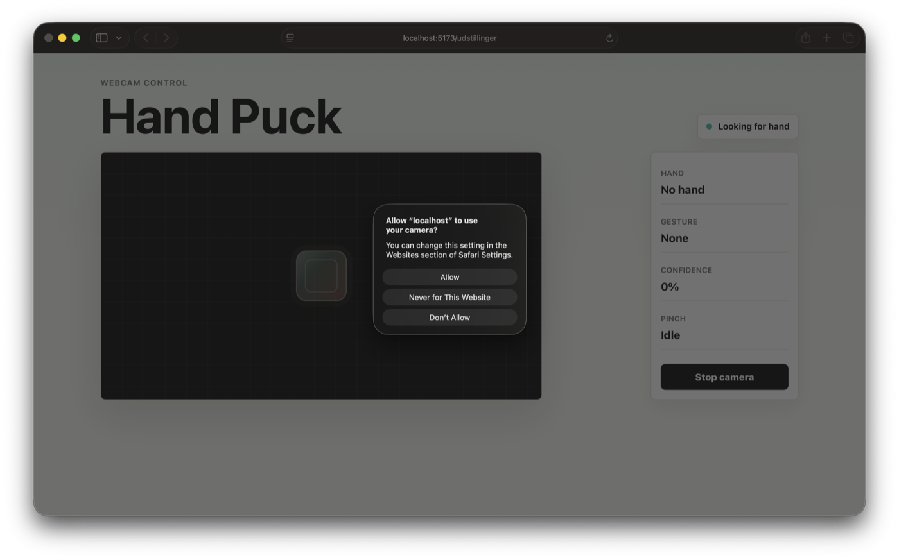
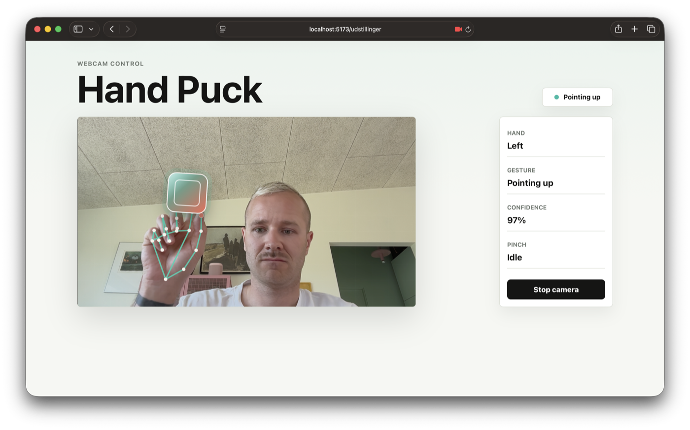
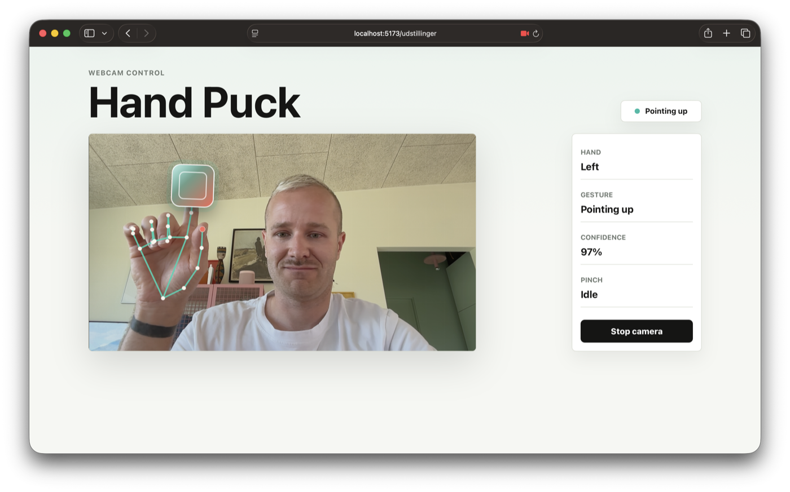
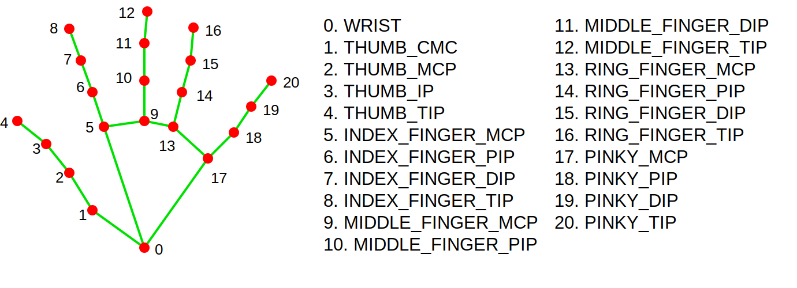

# Hand Puck

Hand Puck is a small React app where you use your webcam to track your hand.
Your index finger moves a puck on the screen, and simple hand gestures change
the state shown in the control panel.

You can use this as a starting point for building your own webcam hand gesture
experiments.

After you can run the app, read the sections `How to Add Your Own Gesture` and
`Project Ideas`. They show you where to change the code and give you ideas for
what to build next.

## What You Should Focus On

The most important part of this project is the path from webcam input to visible
interaction:

1. The webcam gives the browser a video frame.
2. MediaPipe finds hand landmarks in that frame.
3. `getHandGesture` turns those landmarks into simple gesture values.
4. React updates the control panel.
5. `movePuckWithGesture` changes what you see on the screen.

As you experiment, focus on these ideas:

- Landmarks are points on the hand with `x` and `y` values.
- A gesture can start as one small true-or-false check.
- The control panel helps you test your gesture before you add behavior.
- React components should show the interface.
- The custom hook should handle webcam and tracking logic.
- Change one idea at a time, so you know what caused the result.

You do not need to understand every MediaPipe detail before you begin. Use
MediaPipe as a library that gives you hand points, then write your own rules on
top of those points.

## What You Will Build With

This project uses a few libraries and tools.

`React` is used to build the user interface from components.

`React DOM` connects the React app to the browser page.

`Vite` runs the local development server and builds the project.

`react-webcam` gives you a ready-made webcam component. This means you do not
have to write the browser camera setup yourself.

`@mediapipe/tasks-vision` finds hand landmarks in each webcam frame. A landmark
is one tracked point on the hand, such as the wrist, thumb tip, or index finger
tip.

## Before You Start

You need:

- A GitHub account.
- GitHub Desktop installed.
- Visual Studio Code installed.
- Node.js installed.
- A browser with webcam support, for example Chrome, Edge, or Firefox.
- Permission to use your webcam.

Webcam access works on `localhost`. Do not open `index.html` directly by
double-clicking it, because the browser will usually block camera access.

## Install and Run the Project

You will use this project as a GitHub template.

The template repository is:

```text
https://github.com/cederdorff/webcam-ui
```

### 1. Create Your Own Copy

Open the template repository in your browser:

[github.com/cederdorff/webcam-ui](https://github.com/cederdorff/webcam-ui)

Click `Use this template`.

Create a new repository on your own GitHub account. Give it a clear name, for
example:

```text
webcam-gesture-project
```

Now you have your own copy of the project.

### 2. Download Your Copy

On your new GitHub repository page, click the green `Code` button.

Choose `Open with GitHub Desktop`.

GitHub Desktop will open and ask where you want to save the project on your
computer.

Choose a folder and click `Clone`.

You can also clone from inside GitHub Desktop by choosing
`File` -> `Clone repository` and selecting your new repository.

### 3. Open the Project in VS Code

In GitHub Desktop, click `Open in Visual Studio Code`.

VS Code should now open your project folder.

### 4. Open a Terminal in VS Code

In VS Code, open a new terminal:

`Terminal` -> `New Terminal`

The terminal should open at the bottom of VS Code.

### 5. Install the Project

In the VS Code terminal, run:

```bash
npm install
```

This downloads the libraries the project needs.

### 6. Start the Development Server

In the same VS Code terminal, run:

```bash
npm run dev
```

The terminal will show a local address, usually:

```text
http://localhost:5173/
```

Open that address in your browser.

### 7. Try the App

In the browser:

1. Click `Start camera`.
2. Allow webcam permission when the browser asks.
3. Hold one hand in front of the camera.
4. Move your index finger to move the puck.
5. Touch your index finger and thumb together to trigger pinch mode.

If you change the code, the browser should update automatically. If it does not,
refresh the page.

## What You Should See

When you click `Start camera`, your browser may ask for camera permission.
Choose `Allow`.



After the camera starts, the status may say `Looking for hand`. This means the
app is running, but MediaPipe has not found a hand yet.

When MediaPipe finds your hand, you should see:

- your webcam image,
- dots and lines drawn on your hand,
- the puck following your index finger,
- the current gesture in the status pill,
- live values in the control panel.

If you point one finger upward, the gesture should change to `Pointing up`. If
you touch your thumb and index finger together, the pinch value should change to
`Active`.



The puck follows your index finger. When you move your hand, the puck should move
with it.



## Project Structure

```text
src/
  App.jsx                         Puts the page together.
  components/
    TrackingStage.jsx             Shows the webcam, canvas, and puck.
    ControlPanel.jsx              Shows hand, gesture, confidence, and pinch state.
    StatusPill.jsx                Shows the current tracking status.
  hooks/
    useHandTracking.js            Starts/stops tracking and reads webcam frames.
  gestures.js                     Your main playground for creating gestures.
  handTracking.js                 MediaPipe setup and hand drawing helpers.
  App.css                         Styling for the app.
  index.css                       Global page styling.
  main.jsx                        Starts React.
```

A good reading order is:

1. `src/App.jsx`
2. `src/components/TrackingStage.jsx`
3. `src/components/ControlPanel.jsx`
4. `src/hooks/useHandTracking.js`
5. `src/gestures.js`
6. `src/handTracking.js`

## React Components

### `App.jsx`

`App` is the main component.

It does not do the hand tracking itself. Instead, it uses the `useHandTracking`
hook and passes values into the UI components.

It renders:

- `StatusPill`
- `TrackingStage`
- `ControlPanel`

### `TrackingStage.jsx`

`TrackingStage` is the visual webcam area.

It contains:

- the `Webcam` component from `react-webcam`,
- the `canvas` where hand landmarks are drawn,
- the puck that follows your hand,
- the `Start camera` button overlay.

This is the component to change if you want to add more objects to the webcam
area.

### `ControlPanel.jsx`

`ControlPanel` shows useful live data:

- which hand is detected,
- which gesture is active,
- tracking confidence,
- whether pinch is active.

This is the component to change if you want to show more gesture data.

### `StatusPill.jsx`

`StatusPill` shows the current app status, for example:

- `Ready`
- `Loading model`
- `Looking for hand`
- `Pinch active`
- `Camera blocked`

## The Custom Hook

### `useHandTracking.js`

`useHandTracking` is a custom React hook.

It keeps the camera and tracking logic out of the UI components. This makes the
components easier to read.

The hook is responsible for:

- loading the MediaPipe hand model,
- starting and stopping tracking,
- reading each webcam frame,
- asking MediaPipe to detect a hand,
- calling `getHandGesture`,
- moving the puck,
- updating React state for the control panel.

The most important function in this file is `runFrameLoop`.

That function runs again and again with `requestAnimationFrame`.

Each time it runs, it:

1. Gets the current webcam video frame.
2. Sends the frame to MediaPipe.
3. Gets the hand landmarks.
4. Sends the landmarks to `gestures.js`.
5. Updates the UI.

## The Gesture Playground

### `gestures.js`

This is the best file to start changing.

It has two main functions:

```js
getHandGesture(landmarks);
movePuckWithGesture(gesture, puck);
```

`getHandGesture` reads the hand landmarks and decides which gesture is active.

`movePuckWithGesture` uses the gesture data to move the puck on the screen.

Right now, the project detects:

- `Pinch`
- `Open hand`
- `Pointing up`
- `Tracking`

The control panel shows the current gesture, so you can quickly test whether
your changes work.

## MediaPipe Helpers

### `handTracking.js`

This file hides the MediaPipe setup details.

It contains:

- the webcam video constraints,
- the default tracking state,
- the MediaPipe model loading code,
- canvas resize and clear helpers,
- hand landmark drawing code.

You usually do not need to edit this file when creating a new gesture. Start in
`gestures.js` instead.

## Hand Landmarks

MediaPipe gives you a list of hand points called landmarks.

Use this picture when you choose which landmarks you want to compare:



The red dots are the landmarks. The green lines show how the points are connected
on the hand.

Each landmark has a number. In code, you get a landmark by using that number:

```js
const wrist = landmarks[0];
const thumbTip = landmarks[4];
const indexTip = landmarks[8];
```

Useful landmark numbers:

```text
0   wrist
4   thumb tip
8   index finger tip
12  middle finger tip
16  ring finger tip
20  pinky tip
```

Each landmark has an `x` and `y` value between `0` and `1`.

For example:

```js
const indexTip = landmarks[8];
const thumbTip = landmarks[4];
```

You can read that example like this:

- `landmarks[8]` means the index finger tip.
- `landmarks[4]` means the thumb tip.
- Comparing those two points is how you can detect a pinch.

In `gestures.js`, these numbers are given readable names:

```js
const LANDMARK = {
  WRIST: 0,
  THUMB_TIP: 4,
  INDEX_TIP: 8
};
```

Using names like `INDEX_TIP` is easier to read than using numbers everywhere.

## How to Add Your Own Gesture

Open `src/gestures.js`.

Before you write code, describe your gesture in one sentence:

```text
The gesture is active when ...
```

For example:

```text
The gesture is active when the index fingertip is left of the wrist.
```

You will usually work in three steps:

1. Choose which landmarks you need.
2. Create a boolean variable that checks if the gesture is happening.
3. Show the gesture name in the control panel.

### Example: Add `Pointing left`

First, look inside `getHandGesture`.

You already have access to useful points:

```js
const wrist = landmarks[LANDMARK.WRIST];
const indexTip = landmarks[LANDMARK.INDEX_TIP];
```

The hand landmarks use values between `0` and `1`.

For `x`:

- smaller values are more to the left,
- larger values are more to the right.

For `y`:

- smaller values are higher on the screen,
- larger values are lower on the screen.

The starter project does not detect `Pointing left` yet. That makes it a good
simple gesture to add yourself.

To add `Pointing left`, compare the index fingertip with the wrist:

```js
const isPointingLeft = indexTip.x < wrist.x;
```

This means: the index fingertip is further left than the wrist.
If the direction feels reversed in your webcam preview, change `<` to `>`.

Next, include the new value in the object that is returned from
`getHandGesture`:

```js
return {
  grip,
  indexTip,
  isOpenHand: openFingerCount >= 4,
  isPinching,
  isPointingLeft,
  isPointingUp,
  name: getGestureName({
    isPinching,
    isPointingLeft,
    isPointingUp,
    openFingerCount
  }),
  rotation: clamp((middleBase.x - wrist.x) * -115, -34, 34)
};
```

Then update `getGestureName` so it can return your new gesture name:

```js
function getGestureName({ isPinching, isPointingLeft, isPointingUp, openFingerCount }) {
  if (isPinching) {
    return "Pinch";
  }

  if (isPointingLeft) {
    return "Pointing left";
  }

  if (openFingerCount >= 4) {
    return "Open hand";
  }

  if (isPointingUp) {
    return "Pointing up";
  }

  return "Tracking";
}
```

Now run the app and check the `Gesture` field in the control panel.

### Make the Gesture Do Something

After your gesture is detected, you can use it in `movePuckWithGesture`.

For example, you can make the puck larger when pointing left:

```js
const scale = gesture.isPointingLeft ? 1.6 : 0.96 + gesture.grip * 0.42;

puck.style.setProperty("--scale", String(scale));
```

You can also use gestures in React components. For example, if you add a new
value to the gesture object, you can show it in `ControlPanel.jsx`.

### Tips for Making Gestures

- Start with one simple comparison.
- Test your gesture in the control panel before adding more behavior.
- Use landmark names like `INDEX_TIP` instead of raw numbers.
- If a gesture is too sensitive, change the threshold value.
- Good gestures usually compare two points, or measure the distance between two
  points.

## Gesture Ideas

### Pinch

Compare the thumb tip and index finger tip.

```js
const distance = Math.hypot(indexTip.x - thumbTip.x, indexTip.y - thumbTip.y);
const isPinching = distance < 0.06;
```

### Pointing Up

Compare the index fingertip with the wrist.

```js
const isPointingUp = indexTip.y < wrist.y;
```

Smaller `y` means higher on the screen.

### Open Hand

Check whether several fingertips are higher than their base joints.

```js
const indexIsOpen = landmarks[8].y < landmarks[5].y;
const middleIsOpen = landmarks[12].y < landmarks[9].y;
const ringIsOpen = landmarks[16].y < landmarks[13].y;
const pinkyIsOpen = landmarks[20].y < landmarks[17].y;
```

### Swipe

Store the previous index finger position, then compare it with the new one.

```js
const movedRight = currentIndexX - previousIndexX > 0.1;
```

This is a good next challenge because it introduces memory over time.

## Project Ideas

Here are some ideas you can build from this starter project.

Start small. First make the app detect your gesture. Then make the gesture do
something visible on the screen.

### 1. Change the Puck Color When You Pinch

Use `gesture.isPinching`.

You can update a CSS variable or add an attribute to the puck in
`movePuckWithGesture`.

Try changing the puck color only while the pinch is active.

### 2. Make a Sound When a Pinch Starts

Use the pinch gesture as a trigger.

A good challenge is to play the sound only once when the pinch begins, not again
and again every frame.

Hint: you may need to remember whether the hand was already pinching in the
previous frame.

### 3. Count How Many Times You Pinch

Create a pinch counter.

You can show the counter in `ControlPanel.jsx`.

Hint: just like with sound, count only when the pinch changes from inactive to
active.

### 4. Control an Object With a Different Finger

Right now the puck follows the index finger tip:

```js
gesture.indexTip;
```

Try using the middle finger tip instead.

You will need landmark `12`, which is `MIDDLE_FINGER_TIP`.

### 5. Pause the Puck With a Gesture

Create a gesture such as `Open hand`.

When that gesture is active, stop updating the puck position.

Hint: `movePuckWithGesture` is the place where the puck position is changed.

### 6. Create a Gesture-Controlled Drawing App

Instead of moving a puck, draw on the canvas.

For example:

- move your finger to choose where to draw,
- pinch to draw,
- open your hand to stop drawing.

This is a bigger project because you need to remember previous positions.

### 7. Create a Simple Collection Game

Place objects on the screen and collect them with your hand.

For example:

- move the puck with your index finger,
- collect a target when the puck touches it,
- increase the score,
- spawn a new target.

You can start with one target before adding more.

### 8. Show More Gesture Data in the Control Panel

Add a new value to the object returned from `getHandGesture`.

Then show that value in `ControlPanel.jsx`.

For example, you could show:

- open finger count,
- pinch distance,
- whether your new gesture is active,
- whether the hand is above or below the middle of the screen.

## Troubleshooting

If the camera does not start:

- Make sure you opened the app from `localhost`, not by double-clicking
  `index.html`.
- Make sure the browser has permission to use the camera.
- Close other apps that may already be using the webcam.
- Try refreshing the page.
- Try another browser.

If hand tracking feels slow:

- Use a well-lit room.
- Keep one hand clearly visible.
- Avoid busy backgrounds.
- Move your hand a little slower.

If the app says `Camera blocked`:

- Open the browser site settings.
- Allow camera access for `localhost`.
- Refresh the page.
